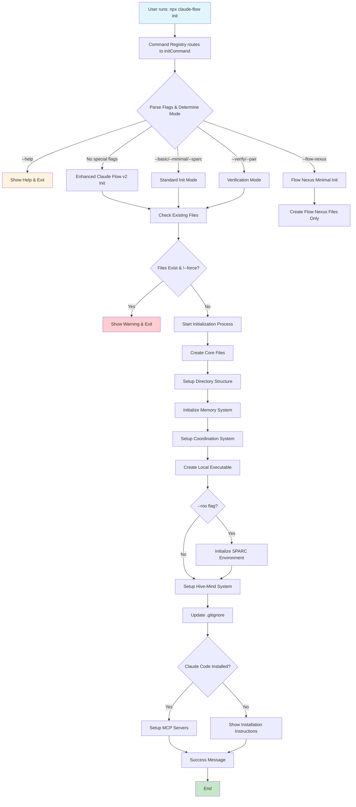
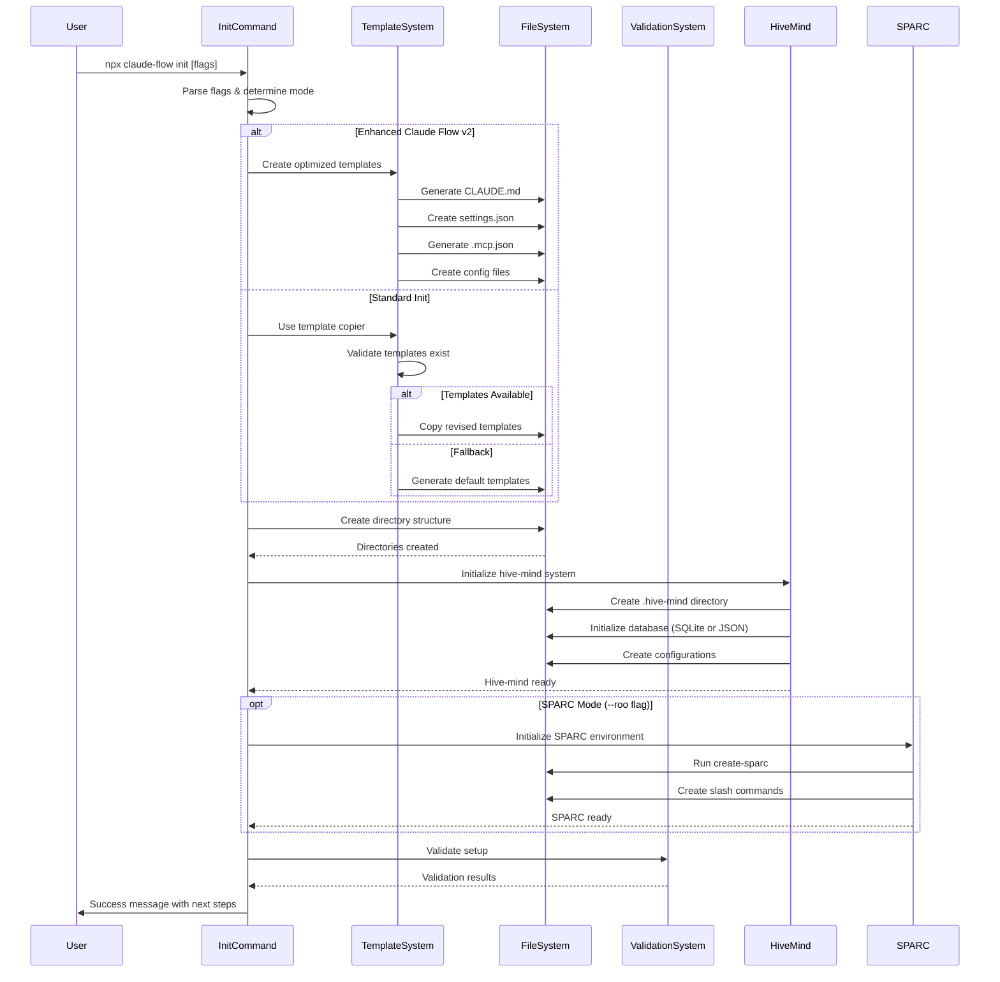
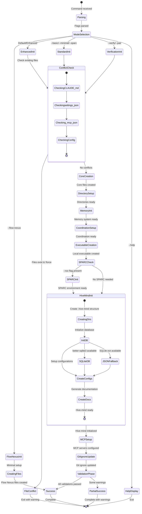
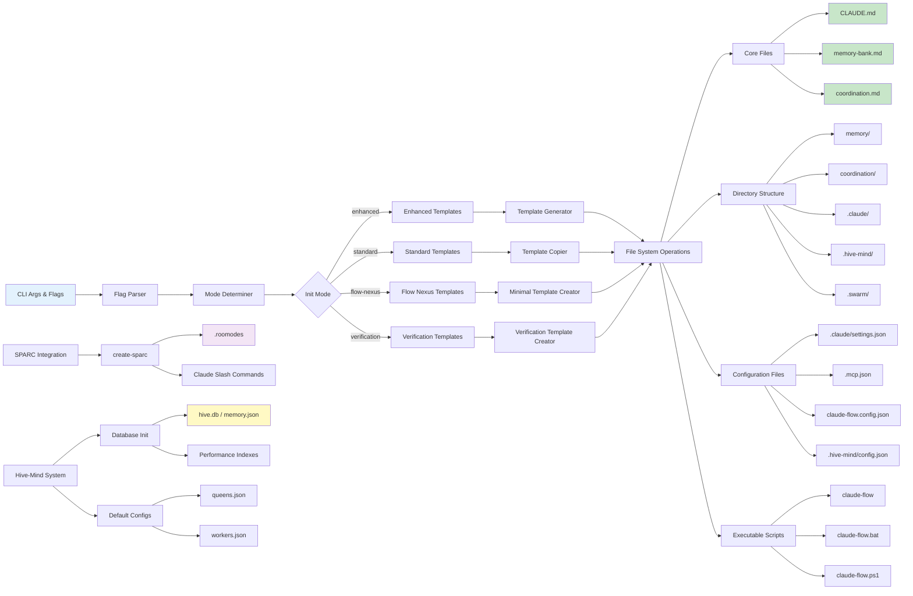
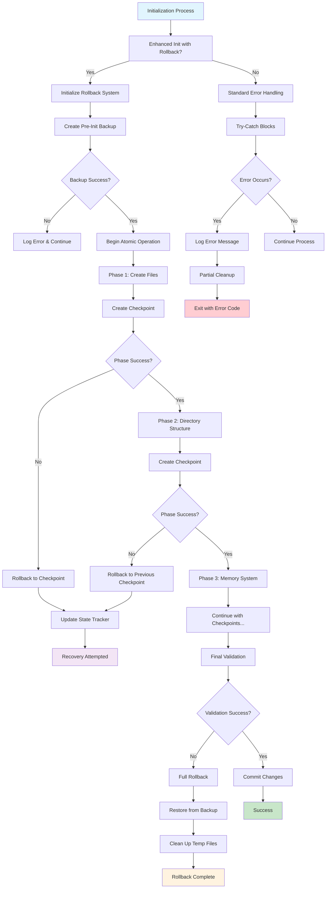
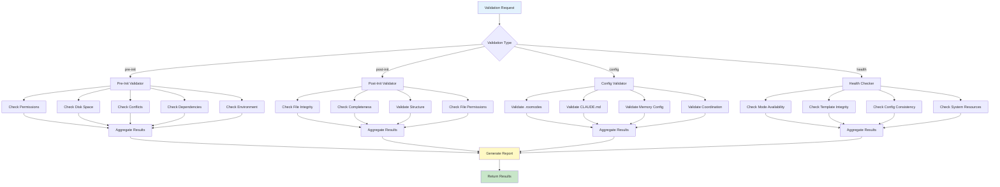

# Claude Flow Init Command Execution Flow

This document provides detailed Mermaid diagrams showing the claude-flow init command execution flow, including all major paths, error handling, and rollback mechanisms.

## 1. Main Execution Flow

## 2. Template Generation Sequence

## 3. State Transitions During Initialization

## 4. Data Flow from Input to Output Files

## 5. Error Handling and Rollback Mechanisms

## 6. Validation System Flow

## Key Components and Responsibilities

### 1. Command Registry
- Routes `init` command to `initCommand` handler
- Manages command metadata and help information
- Provides extensible command registration system

### 2. Init Command Handler
- Parses command line flags and arguments
- Determines initialization mode (enhanced, standard, flow-nexus, verification)
- Orchestrates the entire initialization process
- Handles different execution paths based on flags

### 3. Template System
- **Enhanced Templates**: Generated programmatically for v2.0.0 features
- **Standard Templates**: File-based templates copied from repository
- **Flow Nexus**: Minimal setup with only essential files
- **Verification**: Special templates for verification and pair programming

### 4. Rollback System
- **Backup Manager**: Creates and manages backups before initialization
- **State Tracker**: Tracks initialization phases and checkpoints
- **Rollback Executor**: Performs full or partial rollbacks
- **Recovery Manager**: Handles automatic recovery from common failures

### 5. Validation System
- **Pre-Init Validation**: Checks permissions, disk space, conflicts
- **Post-Init Validation**: Verifies file integrity and completeness
- **Config Validation**: Validates configuration files and structure
- **Health Checker**: Performs system health and resource checks

### 6. Hive-Mind Initialization
- Creates comprehensive directory structure (`.hive-mind/`)
- Initializes database (SQLite with fallback to JSON)
- Sets up queen and worker configurations
- Creates performance monitoring and consensus systems

### 7. SPARC Integration
- Only activated with `--roo` flag
- Runs `create-sparc` for full SPARC environment
- Creates Claude Code slash commands
- Sets up specialized development modes

### 8. MCP Server Setup
- Automatically detects Claude Code installation
- Registers claude-flow, ruv-swarm, and flow-nexus MCP servers
- Creates project-level `.mcp.json` configuration
- Provides manual setup instructions if Claude Code not installed

## Error Handling Strategies

1. **Graceful Degradation**: Falls back to simpler alternatives when advanced features fail
2. **Atomic Operations**: Uses rollback system for enhanced initialization
3. **Comprehensive Logging**: Provides detailed error messages and context
4. **Recovery Mechanisms**: Automatic cleanup and recovery from partial failures
5. **Validation Gates**: Multiple validation phases prevent invalid states

This documentation provides a comprehensive view of the claude-flow init command execution flow, showing all major decision points, error handling paths, and system integrations.