# Claude Flow Init Command: Comprehensive Technical Guide

> **Created by Claude Flow Agent Swarm** | Technical Documentation v2.0.0

## Table of Contents

1. [Executive Summary](#executive-summary)
2. [Architecture Overview](#architecture-overview)
3. [Initialization Flow](#initialization-flow)
4. [Data Flow Analysis](#data-flow-analysis)
5. [Key Components](#key-components)
6. [Command Modes](#command-modes)
7. [File Structure Created](#file-structure-created)
8. [Configuration Options](#configuration-options)
9. [Template System](#template-system)
10. [Integration Features](#integration-features)
11. [State Management](#state-management)
12. [Error Handling & Recovery](#error-handling--recovery)
13. [Code Examples](#code-examples)
14. [Best Practices](#best-practices)

---

## Executive Summary

The `claude-flow init` command is the foundational setup tool for the Claude Flow ecosystem, a sophisticated AI orchestration platform that enables multi-agent coordination, swarm intelligence, and automated development workflows. This command initializes projects with comprehensive tooling for AI-driven development, including the SPARC methodology, hive-mind swarm systems, and deep integration with Claude Code.

### What It Does

- **Project Initialization**: Creates a complete development environment with AI orchestration capabilities
- **Multi-Mode Setup**: Supports 6 different initialization modes for various use cases
- **Swarm Intelligence**: Sets up hive-mind systems with collective decision-making
- **SPARC Integration**: Implements Specification, Pseudocode, Architecture, Refinement, Completion methodology
- **Tool Integration**: Configures Claude Code CLI, MCP servers, and GitHub automation
- **Template Management**: Generates optimized configuration files and project structure

### Why It's Important

The init command is the entry point into the Claude Flow ecosystem, which has demonstrated:
- **84.8% SWE-Bench solve rate** through coordinated AI agents
- **32.3% token reduction** via intelligent coordination
- **2.8-4.4x speed improvement** through parallel execution
- **27+ neural models** for diverse cognitive approaches

---

## Architecture Overview

### C4 Context Diagram


### C4 Container Diagram


### C4 Component Diagram


---

## Initialization Flow

### Main Execution Flow


### Template Generation Sequence

```mermaid
sequenceDiagram
    participant User
    participant InitHandler as Init Handler
    participant ModeDetector as Mode Detector
    participant TemplateSystem as Template System
    participant FileSystem as File System
    participant Validator as Validator

    User->>InitHandler: npx claude-flow init --sparc
    InitHandler->>ModeDetector: Parse flags
    ModeDetector-->>InitHandler: SPARC mode detected

    InitHandler->>Validator: Pre-init validation
    Validator-->>InitHandler: Environment OK

    InitHandler->>TemplateSystem: Request SPARC templates
    TemplateSystem->>TemplateSystem: Select createSparcClaudeMd()
    TemplateSystem->>TemplateSystem: Generate memory-bank.md
    TemplateSystem->>TemplateSystem: Generate coordination.md

    TemplateSystem->>FileSystem: Write CLAUDE.md
    TemplateSystem->>FileSystem: Write memory-bank.md
    TemplateSystem->>FileSystem: Write coordination.md

    InitHandler->>TemplateSystem: Create directories
    TemplateSystem->>FileSystem: mkdir memory/
    TemplateSystem->>FileSystem: mkdir coordination/
    TemplateSystem->>FileSystem: mkdir .claude/
    TemplateSystem->>FileSystem: mkdir .hive-mind/

    InitHandler->>TemplateSystem: Initialize SPARC
    TemplateSystem->>FileSystem: Create .roomodes
    TemplateSystem->>FileSystem: Create .roo/ structure
    TemplateSystem->>FileSystem: Generate slash commands

    InitHandler->>Validator: Post-init validation
    Validator-->>InitHandler: All files created successfully
    InitHandler-->>User: ✅ Initialization complete
```



### State Transitions During Initialization


---

## Data Flow Analysis

### Input Processing Flow


### File Generation Pipeline


### Directory Structure Creation Flow


---

## Key Components

### Command Registry System

The command registry (`/src/cli/command-registry.js`) serves as the central routing system:


**Key Features:**
- Extensible command registration system
- 40+ registered commands
- Handler delegation with parameter passing
- Built-in help system integration
- Performance tracking capabilities

### Template System Architecture

```mermaid
flowchart LR
    A[Template Request] --> B{Template Strategy}

    B -->|Generated| C[Dynamic Generation]
    B -->|File-based| D[File Reading]

    C --> E[Template Functions]
    E --> F[createSparcClaudeMd()]
    E --> G[createFullClaudeMd()]
    E --> H[createMinimalClaudeMd()]
    E --> I[createFlowNexusClaudeMd()]

    D --> J[Template Directory]
    J --> K[revised-templates/]
    K --> L[CLAUDE.md]
    K --> M[memory-bank.md]
    K --> N[coordination.md]

    F --> O[Content Assembly]
    G --> O
    H --> O
    I --> O
    L --> O
    M --> O
    N --> O

    O --> P[Variable Substitution]
    P --> Q[Final Output]
```

**Template Categories:**
- **Core Templates**: CLAUDE.md, memory-bank.md, coordination.md
- **SPARC Templates**: .roomodes, mode configurations, slash commands
- **Agent Templates**: 64 specialized agent definitions
- **Configuration Templates**: MCP, Claude Code, GitHub integration
- **Documentation Templates**: README files, help documentation

### Batch Processing System

The batch processor (`/src/cli/simple-commands/init/batch-init.js`) enables parallel project initialization:

```mermaid
flowchart TD
    A[Batch Request] --> B[Resource Manager]
    B --> C[Progress Tracker]
    C --> D[Performance Monitor]

    B --> E[Concurrency Control]
    E --> F[Max 5 Concurrent Projects]
    F --> G[Resource Acquisition]

    G --> H[Project 1 Init]
    G --> I[Project 2 Init]
    G --> J[Project 3 Init]
    G --> K[Project N Init]

    H --> L[Template Application]
    I --> L
    J --> L
    K --> L

    L --> M[Environment Configuration]
    M --> N[SPARC Setup (if enabled)]
    N --> O[Result Collection]

    C --> P[Real-time Progress Display]
    D --> Q[Performance Metrics]
    O --> R[Batch Report Generation]
```

**Batch Features:**
- **Parallel Processing**: Up to 20 concurrent projects
- **Resource Management**: Memory and CPU throttling
- **Progress Tracking**: Real-time visual progress bars
- **Template Support**: All project templates supported
- **Environment Variants**: Dev, staging, production configurations
- **Performance Monitoring**: Execution time and resource usage tracking

### Hive Mind Initialization System


**Hive Mind Features:**
- **Collective Intelligence**: Queen-led agent coordination
- **Consensus Mechanisms**: 4 voting algorithms (majority, weighted, unanimous, quorum)
- **Memory Persistence**: SQLite database with JSON fallback
- **Performance Tracking**: Real-time metrics and optimization
- **Adaptive Learning**: System improves over time
- **Fault Tolerance**: Self-healing and recovery capabilities

---

## Command Modes

### 1. Enhanced Claude Flow v2.0.0 (Default)

**Activation**: Default mode (no specific flags required)

```bash
npx claude-flow init
# or explicitly
npx claude-flow init --enhanced
```

**Features Created:**
- **Complete AI Development Environment**: Full Claude Flow v2.0.0 setup
- **Hive-Mind System**: Collective intelligence with SQLite database
- **64 Specialized Agents**: Organized in categories (core, specialized, github, etc.)
- **Advanced Configuration**: claude-flow.config.json with v2.0.0 features
- **MCP Integration**: Automatic server registration
- **Performance Monitoring**: Token tracking and telemetry setup
- **Command Documentation**: Complete reference in .claude/commands/
- **Helper Scripts**: Setup, GitHub integration, checkpoint management

**File Structure:**
```
project/
├── CLAUDE.md (Claude Flow v2.0.0 optimized)
├── .claude/
│   ├── settings.json (with hooks and MCP config)
│   ├── commands/ (complete command documentation)
│   ├── helpers/ (7 helper scripts)
│   └── agents/ (64 specialized agents)
├── .mcp.json (project-scoped MCP servers)
├── claude-flow.config.json (v2.0.0 features)
├── .hive-mind/ (collective intelligence system)
├── .swarm/ (shared memory)
└── claude-flow (local executable wrapper)
```

### 2. SPARC Development Mode

**Activation**: `--roo` flag (only with this specific flag)

```bash
npx claude-flow init --roo
# Force overwrite existing files
npx claude-flow init --roo --force
```

**Features Created:**
- **Complete SPARC Environment**: Specification, Pseudocode, Architecture, Refinement, Completion
- **20+ Development Modes**: Specialized AI agents for different development phases
- **.roomodes Configuration**: Central mode registry
- **Claude Code Slash Commands**: Auto-generated commands for each mode
- **TDD Workflow Integration**: Test-Driven Development support
- **SPARC Directory Structure**: .roo/ with templates and workflows

**SPARC Modes Created:**
```javascript
// Core Development Modes
architect     - System design and architecture
code         - Clean, efficient code writing
tdd          - Test-Driven Development
spec-pseudocode - Requirements and pseudocode
integration  - System integration
debug        - Troubleshooting and debugging
security-review - Security analysis
docs-writer  - Documentation creation
swarm        - Multi-agent coordination

// Specialized Modes
data-analyst, performance-optimizer, api-designer,
frontend-specialist, backend-specialist, devops-engineer,
mobile-developer, ml-engineer, qa-specialist,
product-manager, project-coordinator
```

### 3. Minimal Setup Mode

**Activation**: `--minimal` flag

```bash
npx claude-flow init --minimal
```

**Features:**
- **Lightweight Configuration**: Essential files only
- **Basic Template Variants**: Simplified versions of core files
- **Reduced Directory Structure**: Core directories only
- **No Advanced Features**: No hive-mind, no SPARC, no MCP setup

**Files Created:**
```
project/
├── CLAUDE.md (minimal configuration)
├── memory-bank.md (basic memory system)
├── coordination.md (simple coordination)
├── memory/
│   ├── agents/
│   └── sessions/
├── coordination/
└── .claude/
    └── commands/
```

### 4. Flow Nexus Mode

**Activation**: `--flow-nexus` flag

```bash
npx claude-flow init --flow-nexus
```

**Features:**
- **Cloud Platform Integration**: Flow Nexus documentation and tools
- **Minimal Setup**: Only essential Flow Nexus files
- **Specialized Commands**: Flow Nexus MCP tool documentation
- **Agent Library**: Flow Nexus-specific agents

**Files Created:**
```
project/
├── CLAUDE.md (Flow Nexus integration focus)
├── .claude/
│   ├── commands/flow-nexus/ (Flow Nexus commands)
│   └── agents/flow-nexus/ (Flow Nexus agents)
```

### 5. Verification & Pair Programming Mode

**Activation**: `--verify` or `--pair` flags

```bash
npx claude-flow init --verify
npx claude-flow init --pair
```

**Features:**
- **Verification-Focused Configuration**: CLAUDE.md optimized for verification
- **Truth Enforcement System**: 0.95 minimum truth threshold
- **Pair Programming Support**: Interactive development setup
- **Quality Assurance**: Comprehensive validation system

### 6. Batch Processing Mode

**Activation**: `--batch-init` with project list

```bash
# Initialize multiple projects
npx claude-flow init --batch-init "project1,project2,project3"

# Use configuration file
npx claude-flow init --config batch-config.json

# With templates and environments
npx claude-flow init --batch-init "api1,api2" --template web-api --environments "dev,staging,prod"
```

**Features:**
- **Parallel Processing**: Up to 20 concurrent project initializations
- **Template Support**: 4 project templates (web-api, react-app, microservice, cli-tool)
- **Environment Variants**: Different configurations for dev/staging/prod
- **Progress Tracking**: Real-time visual progress with performance metrics
- **Resource Management**: Memory and CPU throttling
- **Configuration Files**: JSON-based batch configuration support

---

## File Structure Created

### Core Configuration Files

#### CLAUDE.md (Project Configuration)
The central configuration file that varies by mode:

**Enhanced Mode Features:**
```markdown
# Claude Code Configuration - SPARC Development Environment

## 🚨 CRITICAL: Concurrent Execution Rules
**ABSOLUTE RULE**: ALL operations MUST be concurrent/parallel in ONE message

## 🎯 Claude Code vs MCP Tools
### Claude Code Handles ALL:
- File operations (Read/Write/Edit/Glob/Grep)
- Code generation & programming
- TodoWrite & task management

### MCP Tools ONLY:
- Coordination & planning
- Memory management
- Swarm orchestration

## 🤖 Agent Reference (54 Total)
[Complete agent documentation with categories]

## 🚀 Flow Nexus Cloud Platform
[Cloud integration documentation]
```

#### memory-bank.md (Memory System)
Documents the persistent memory and agent coordination system:

```markdown
# Memory Bank - Persistent AI Agent Memory System

## Memory Architecture
- **Collective Memory**: Shared knowledge base across all agents
- **Session Persistence**: Maintains context across interactions
- **Agent Memory**: Individual agent learning and adaptation
- **Cross-Session Memory**: Long-term knowledge retention

## Storage Systems
- **Primary**: SQLite database (.hive-mind/hive.db)
- **Fallback**: JSON files (memory/claude-flow-data.json)
- **Distributed**: Cross-agent memory sharing
```

#### coordination.md (Agent Coordination)
Defines how multiple AI agents work together:

```markdown
# Agent Coordination System

## Coordination Patterns
- **Hierarchical**: Queen-led with specialized workers
- **Mesh**: Peer-to-peer collaboration
- **Pipeline**: Sequential task processing
- **Swarm**: Collective intelligence approaches

## Communication Protocols
- **Message Queues**: Asynchronous communication
- **Consensus Building**: Democratic decision making
- **Task Distribution**: Work allocation strategies
```

### Directory Structure

#### Complete Enhanced Mode Structure
```
project/
├── CLAUDE.md                          # Main configuration
├── memory-bank.md                     # Memory system docs
├── coordination.md                    # Coordination guide
├── .mcp.json                          # MCP server configuration
├── claude-flow.config.json            # Claude Flow settings
├── claude-flow                        # Local executable (Unix)
├── claude-flow.bat                    # Local executable (Windows)
├── claude-flow.ps1                    # Local executable (PowerShell)
│
├── memory/                            # Persistence layer
│   ├── claude-flow-data.json         # Main data store
│   ├── agents/                       # Agent-specific memory
│   │   └── README.md                 # Agent memory guide
│   └── sessions/                     # Session persistence
│       └── README.md                 # Session guide
│
├── coordination/                      # Agent coordination
│   ├── memory_bank/                  # Shared memory
│   ├── subtasks/                     # Task decomposition
│   └── orchestration/                # Workflow management
│
├── .claude/                          # Claude Code integration
│   ├── settings.json                 # IDE settings with hooks
│   ├── settings.local.json           # Local MCP permissions
│   ├── commands/                     # Command documentation
│   │   ├── core/                    # Core commands (12 files)
│   │   ├── swarm/                   # Swarm commands (8 files)
│   │   ├── github/                  # GitHub commands (6 files)
│   │   ├── analysis/                # Analysis commands (5 files)
│   │   ├── coordination/            # Coordination commands (4 files)
│   │   └── flow-nexus/              # Flow Nexus commands (18 files)
│   ├── helpers/                     # Helper scripts
│   │   ├── setup-mcp.sh            # MCP server setup
│   │   ├── quick-start.sh           # Quick start guide
│   │   ├── github-setup.sh          # GitHub integration
│   │   ├── github-safe.js           # Safe GitHub operations
│   │   ├── standard-checkpoint-hooks.sh # Git checkpoints
│   │   └── checkpoint-manager.sh     # Checkpoint management
│   ├── agents/                      # Agent definitions (64 total)
│   │   ├── core/                    # Core agents (5 files)
│   │   ├── specialized/             # Specialized agents (23 files)
│   │   ├── github/                  # GitHub agents (6 files)
│   │   ├── consensus/               # Consensus agents (5 files)
│   │   ├── performance/             # Performance agents (3 files)
│   │   ├── sparc/                   # SPARC agents (6 files)
│   │   ├── testing/                 # Testing agents (2 files)
│   │   ├── migration/               # Migration agents (2 files)
│   │   ├── smart/                   # Smart agents (3 files)
│   │   ├── coordination/            # Coordination agents (3 files)
│   │   ├── template/                # Template agents (1 file)
│   │   ├── development/             # Development agents (3 files)
│   │   └── flow-nexus/              # Flow Nexus agents (2 files)
│   ├── checkpoints/                 # Git checkpoint system
│   └── logs/                        # Operation logs
│
├── .hive-mind/                       # Collective intelligence
│   ├── config.json                  # Hive mind configuration
│   ├── hive.db                      # SQLite database (or memory.json)
│   ├── README.md                    # Documentation
│   ├── sessions/                    # Active sessions
│   ├── memory/                      # Collective memory
│   ├── logs/                        # System logs
│   ├── backups/                     # Automated backups
│   ├── config/                      # Configuration files
│   │   ├── queens.json              # Queen configurations
│   │   └── workers.json             # Worker templates
│   ├── templates/                   # Agent templates
│   └── exports/                     # Data exports
│
├── .swarm/                          # Shared memory (Enhanced mode)
│   └── memory.db                    # Distributed memory database
│
└── .claude-flow/                    # Monitoring & telemetry
    ├── token-usage.json             # Token tracking
    ├── monitoring.config.json       # Monitoring config
    └── env-setup.sh                 # Environment setup
```

#### SPARC Mode Additional Structure (with --roo)
```
project/
├── .roomodes                        # SPARC mode registry
├── .roo/                           # SPARC environment
│   ├── README.md                   # SPARC documentation
│   ├── templates/                  # SPARC templates
│   ├── workflows/                  # Development workflows
│   ├── modes/                      # Mode definitions
│   └── configs/                    # SPARC configurations
│
└── .claude/commands/sparc/         # Generated slash commands
    ├── architect.md                # System architect mode
    ├── code.md                     # Clean coding mode
    ├── tdd.md                      # Test-driven development
    ├── spec-pseudocode.md          # Specification mode
    ├── integration.md              # Integration mode
    ├── debug.md                    # Debugging mode
    ├── security-review.md          # Security analysis
    ├── docs-writer.md              # Documentation mode
    ├── swarm.md                    # Multi-agent coordination
    └── [additional SPARC modes]    # 20+ total modes
```

### Agent System (64 Specialized Agents)

The enhanced mode creates 64 specialized agents organized by category:

#### Core Agents (5)
- **general-purpose**: General tasks and research
- **coder**: Implementation specialist
- **reviewer**: Code review and quality
- **tester**: Testing and validation
- **researcher**: Information gathering

#### Specialized Agents (23)
- **planner**: Strategic planning
- **system-architect**: Architecture design
- **backend-dev**: Backend development
- **mobile-dev**: React Native development
- **ml-developer**: Machine learning
- **api-docs**: API documentation
- **cicd-engineer**: CI/CD pipeline specialist
- **code-analyzer**: Advanced code analysis
- **sparc-coder**: SPARC methodology implementation
- **production-validator**: Production readiness
- **base-template-generator**: Template creation
- **memory-coordinator**: Cross-session memory
- **perf-analyzer**: Performance optimization
- **migration-planner**: System migration
- **smart-agent**: Intelligent coordination
- **swarm-init**: Swarm initialization
- **sparc-coord**: SPARC orchestration
- **task-orchestrator**: Task coordination
- **adaptive-coordinator**: Dynamic coordination
- **mesh-coordinator**: Peer-to-peer coordination
- **hierarchical-coordinator**: Queen-led coordination
- **specification**: Requirements analysis
- **pseudocode**: Algorithm design
- **refinement**: Iterative improvement
- **architecture**: System design

#### GitHub Integration Agents (6)
- **github-modes**: Comprehensive GitHub integration
- **pr-manager**: Pull request management
- **code-review-swarm**: Multi-agent code review
- **issue-tracker**: Issue management
- **release-manager**: Release coordination
- **workflow-automation**: GitHub Actions automation

#### Consensus & Distributed Systems (5)
- **byzantine-coordinator**: Byzantine fault tolerance
- **raft-manager**: Raft consensus algorithm
- **gossip-coordinator**: Gossip protocols
- **crdt-synchronizer**: Conflict-free replicated data
- **quorum-manager**: Dynamic quorum management

#### Performance & Analysis (3)
- **performance-benchmarker**: Performance testing
- **security-manager**: Security implementation
- **repo-architect**: Repository optimization

#### Testing & Validation (2)
- **tdd-london-swarm**: Mock-driven development
- **statusline-setup**: Status line configuration
- **output-style-setup**: Output styling

---

## Configuration Options

### Core Flags

| Flag | Description | Default | Example |
|------|-------------|---------|---------|
| `--force`, `-f` | Overwrite existing files | `false` | `init --force` |
| `--dry-run`, `-d` | Show what would be created without making changes | `false` | `init --dry-run` |
| `--help`, `-h` | Show help information | `false` | `init --help` |

### Mode Selection Flags

| Flag | Description | Mode Activated | Example |
|------|-------------|---------------|---------|
| `--roo` | Initialize with SPARC development environment | SPARC Mode | `init --roo` |
| `--minimal`, `-m` | Create minimal configuration files | Minimal Mode | `init --minimal` |
| `--flow-nexus` | Flow Nexus minimal initialization | Flow Nexus Mode | `init --flow-nexus` |
| `--verify` | Verification-focused configuration | Verification Mode | `init --verify` |
| `--pair` | Pair programming setup | Verification Mode | `init --pair` |
| `--basic` | Legacy/standard initialization | Standard Mode | `init --basic` |

### Advanced Configuration

| Flag | Description | Default | Example |
|------|-------------|---------|---------|
| `--enhanced` | Explicitly use enhanced Claude Flow v2.0.0 | `true` | `init --enhanced` |
| `--safe` | Enhanced initialization with validation | `false` | `init --safe` |
| `--monitoring` | Enable monitoring and telemetry | `false` | `init --monitoring` |
| `--skip-mcp` | Skip MCP server setup | `false` | `init --skip-mcp` |

### Validation & Safety Flags

| Flag | Description | Default | Example |
|------|-------------|---------|---------|
| `--validate` | Run validation checks only | `false` | `init --validate` |
| `--validate-only` | Validation without initialization | `false` | `init --validate-only` |
| `--skip-pre-validation` | Skip pre-initialization validation | `false` | `init --skip-pre-validation` |
| `--skip-backup` | Skip backup creation | `false` | `init --skip-backup` |

### Batch Processing Flags

| Flag | Description | Default | Example |
|------|-------------|---------|---------|
| `--batch-init <projects>` | Initialize multiple projects | `null` | `init --batch-init "p1,p2,p3"` |
| `--config <file>` | Use batch configuration file | `null` | `init --config batch.json` |
| `--template <type>` | Project template to use | `null` | `init --template web-api` |
| `--environments <list>` | Target environments | `["dev"]` | `init --environments "dev,staging,prod"` |
| `--max-concurrent <n>` | Maximum concurrent projects | `5` | `init --max-concurrent 10` |
| `--no-parallel` | Disable parallel processing | `false` | `init --no-parallel` |

### Rollback & Recovery Flags

| Flag | Description | Default | Example |
|------|-------------|---------|---------|
| `--rollback` | Trigger rollback operation | `false` | `init --rollback` |
| `--rollback --full` | Perform full rollback | `false` | `init --rollback --full` |
| `--rollback --partial --phase <name>` | Partial rollback by phase | `false` | `init --rollback --partial --phase sparc-init` |
| `--list-backups` | List available backups | `false` | `init --list-backups` |

---

## Template System

### Template Selection Logic

```mermaid
flowchart TD
    A[Template Request] --> B{Mode Check}

    B -->|Enhanced| C[Use Generated Templates]
    B -->|SPARC| D[Use SPARC Templates]
    B -->|Minimal| E[Use Minimal Variants]
    B -->|Flow Nexus| F[Use Flow Nexus Templates]
    B -->|Verification| G[Use Verification Templates]

    C --> H[createOptimizedSparcClaudeMd()]
    D --> I[createSparcClaudeMd()]
    E --> J[createMinimalClaudeMd()]
    F --> K[createFlowNexusClaudeMd()]
    G --> L[createVerificationClaudeMd()]

    H --> M[Enhanced Features Integration]
    I --> N[SPARC Methodology Integration]
    J --> O[Lightweight Configuration]
    K --> P[Cloud Platform Integration]
    L --> Q[Verification & Truth Enforcement]

    M --> R[Template Assembly]
    N --> R
    O --> R
    P --> R
    Q --> R

    R --> S[Variable Substitution]
    S --> T[Content Validation]
    T --> U[File Output]
```

### Template Categories

#### 1. Generated Templates (Dynamic)
Created programmatically in JavaScript:

**Location**: `/src/cli/simple-commands/init/templates/`

```javascript
// claude-md.js
export function createOptimizedSparcClaudeMd() {
  return `# Claude Code Configuration - SPARC Development Environment

## 🚨 CRITICAL: Concurrent Execution Rules
**ABSOLUTE RULE**: ALL operations MUST be concurrent/parallel in ONE message

## 🎯 Claude Code vs MCP Tools
### Claude Code Handles ALL:
- File operations (Read/Write/Edit/Glob/Grep)
- Code generation & programming

### MCP Tools ONLY:
- Coordination & planning
- Memory management

## 🤖 Agent Reference (54 Total)
${generateAgentDocumentation()}

## 🚀 Performance Tips
1. **Batch Everything** - Multiple operations = 1 message
2. **Parallel First** - Think concurrent execution
...`;
}
```

**Generated Template Functions:**
- `createOptimizedSparcClaudeMd()` - Enhanced mode with v2.0.0 features
- `createSparcClaudeMd()` - SPARC development environment
- `createFullClaudeMd()` - Standard comprehensive setup
- `createMinimalClaudeMd()` - Lightweight configuration
- `createFlowNexusClaudeMd()` - Cloud platform focus
- `createVerificationClaudeMd()` - Verification and pair programming

#### 2. File-based Templates (Static)
Pre-written template files that are copied:

**Location**: Template files are looked for in the repository structure

**Fallback Strategy**: When file-based templates aren't available, the system falls back to generated templates

#### 3. Template Variables

Templates support variable substitution:

```javascript
// Common template variables
const templateVars = {
  PROJECT_NAME: "my-project",
  PROJECT_DESCRIPTION: "AI-enhanced development project",
  ENVIRONMENT: "development",
  AGENT_COUNT: 64,
  CLAUDE_FLOW_VERSION: "2.0.0",
  FEATURES_ENABLED: ["hive-mind", "sparc", "mcp-integration"]
};
```

### Template Customization

#### Configuration File Approach
Create a `.claude-flow.config.json` to customize templates:

```json
{
  "templates": {
    "claudeMd": {
      "customSections": [
        "## Custom Project Rules",
        "## Team Guidelines"
      ],
      "agents": {
        "include": ["coder", "reviewer", "tester"],
        "exclude": ["mobile-dev"]
      }
    },
    "memoryBank": {
      "retentionDays": 60,
      "compressionEnabled": true
    }
  },
  "features": {
    "hive-mind": true,
    "sparc": false,
    "monitoring": true
  }
}
```

#### Environment-Specific Templates
Templates can vary by environment:

```javascript
// Development environment
const devTemplate = {
  features: {
    debug: true,
    verbose: true,
    monitoring: false
  }
};

// Production environment
const prodTemplate = {
  features: {
    debug: false,
    verbose: false,
    monitoring: true,
    optimization: true
  }
};
```

---

## Integration Features

### Claude Code CLI Integration

The init command provides deep integration with Claude Code:

#### Automatic MCP Server Setup
```javascript
// Automatically configures these MCP servers
const mcpServers = [
  {
    name: 'claude-flow',
    command: 'npx claude-flow@alpha mcp start',
    description: 'Claude Flow MCP server with swarm orchestration'
  },
  {
    name: 'ruv-swarm',
    command: 'npx ruv-swarm mcp start',
    description: 'ruv-swarm MCP server for enhanced coordination'
  },
  {
    name: 'flow-nexus',
    command: 'npx flow-nexus@latest mcp start',
    description: 'Flow Nexus Complete MCP server for advanced AI orchestration'
  }
];
```

#### Settings.json Configuration
Creates comprehensive Claude Code settings:

```json
{
  "hooks": {
    "pre-task": [
      "npx claude-flow@alpha hooks pre-task --description \"{{description}}\" --task-id \"{{task_id}}\""
    ],
    "post-task": [
      "npx claude-flow@alpha hooks post-task --task-id \"{{task_id}}\" --analyze-performance"
    ],
    "post-edit": [
      "npx claude-flow@alpha hooks post-edit --file \"{{file}}\" --memory-key \"swarm/{{agent}}/{{step}}\""
    ]
  },
  "git": {
    "enableCheckpoints": true,
    "checkpointHooks": {
      "pre-commit": ".claude/helpers/standard-checkpoint-hooks.sh",
      "post-commit": ".claude/helpers/checkpoint-manager.sh"
    }
  },
  "mcp": {
    "servers": {
      "claude-flow": {
        "command": "npx",
        "args": ["claude-flow@alpha", "mcp", "start"]
      }
    }
  }
}
```

### GitHub Integration

#### Repository Automation
Creates GitHub-specific configuration and automation:

```bash
# .claude/helpers/github-setup.sh
#!/bin/bash
echo "🚀 Setting up GitHub integration..."

# Setup branch protection
gh api repos/:owner/:repo/branches/main/protection \
  --method PUT \
  --field required_status_checks='{"strict":true,"contexts":["ci"]}' \
  --field enforce_admins=true

# Create issue templates
mkdir -p .github/ISSUE_TEMPLATE

# Setup Claude Flow GitHub Actions
mkdir -p .github/workflows
```

#### GitHub Actions Integration
Pre-configured workflows for Claude Flow projects:

```yaml
# .github/workflows/claude-flow-ci.yml
name: Claude Flow CI
on: [push, pull_request]

jobs:
  test:
    runs-on: ubuntu-latest
    steps:
      - uses: actions/checkout@v3
      - uses: actions/setup-node@v3
        with:
          node-version: '18'
      - run: npm ci
      - run: npx claude-flow validate
      - run: npx claude-flow test
```

### Hive-Mind System Integration

#### Collective Intelligence Features
- **Distributed Decision Making**: Multiple AI agents vote on decisions
- **Shared Memory**: Cross-agent knowledge sharing
- **Performance Learning**: System improves over time
- **Fault Tolerance**: Self-healing capabilities

#### Database Schema
Creates comprehensive SQLite schema:

```sql
-- Core swarm management
CREATE TABLE swarms (
  id TEXT PRIMARY KEY,
  name TEXT NOT NULL,
  objective TEXT,
  status TEXT DEFAULT 'active',
  topology TEXT DEFAULT 'hierarchical',
  created_at DATETIME DEFAULT CURRENT_TIMESTAMP
);

-- Agent coordination
CREATE TABLE agents (
  id TEXT PRIMARY KEY,
  swarm_id TEXT,
  name TEXT NOT NULL,
  type TEXT NOT NULL,
  capabilities TEXT DEFAULT '[]',
  performance_score REAL DEFAULT 0.5,
  FOREIGN KEY (swarm_id) REFERENCES swarms (id)
);

-- Task management
CREATE TABLE tasks (
  id TEXT PRIMARY KEY,
  swarm_id TEXT,
  agent_id TEXT,
  description TEXT,
  status TEXT DEFAULT 'pending',
  complexity REAL DEFAULT 0.5,
  FOREIGN KEY (swarm_id) REFERENCES swarms (id)
);

-- Consensus building
CREATE TABLE consensus_votes (
  id TEXT PRIMARY KEY,
  proposal_id TEXT NOT NULL,
  agent_id TEXT,
  vote REAL NOT NULL,
  justification TEXT,
  timestamp DATETIME DEFAULT CURRENT_TIMESTAMP
);
```

### Performance Monitoring Integration

#### Token Tracking System
Automatically configures token usage monitoring:

```json
{
  "telemetry": {
    "enabled": true,
    "tokenTracking": {
      "location": ".claude-flow/token-usage.json",
      "hooks": [
        "npx claude-flow@alpha internal track-tokens --session-id {{session_id}}"
      ]
    },
    "claude-code": {
      "env": "CLAUDE_CODE_ENABLE_TELEMETRY=1"
    }
  }
}
```

#### Performance Benchmarks
Sets up performance tracking:

```javascript
// Performance tracking configuration
const performanceConfig = {
  metrics: {
    commandExecution: true,
    tokenUsage: true,
    agentPerformance: true,
    memoryUsage: true
  },
  thresholds: {
    commandTimeout: 30000,
    maxTokensPerHour: 100000,
    maxMemoryMB: 512
  },
  reporting: {
    interval: 'daily',
    format: 'json',
    destination: '.claude-flow/metrics/'
  }
};
```

---

## State Management

### Initialization States

The init command progresses through distinct states:


### State Persistence

#### Checkpoint System
The enhanced mode creates checkpoints at each major phase:

```javascript
// Checkpoint creation
const checkpoints = [
  { phase: 'pre-validation', timestamp: Date.now(), status: 'completed' },
  { phase: 'backup-creation', timestamp: Date.now(), status: 'completed' },
  { phase: 'core-files', timestamp: Date.now(), status: 'in-progress' },
  { phase: 'directory-structure', timestamp: Date.now(), status: 'pending' },
  { phase: 'memory-init', timestamp: Date.now(), status: 'pending' },
  { phase: 'sparc-setup', timestamp: Date.now(), status: 'pending' },
  { phase: 'hive-mind-init', timestamp: Date.now(), status: 'pending' },
  { phase: 'post-validation', timestamp: Date.now(), status: 'pending' }
];
```

#### State Recovery
If initialization fails, the system can recover from the last successful checkpoint:

```javascript
async function recoverFromCheckpoint(checkpointId) {
  const checkpoint = await loadCheckpoint(checkpointId);
  const rollbackSystem = new RollbackSystem();

  // Restore state to checkpoint
  await rollbackSystem.restoreToCheckpoint(checkpoint);

  // Resume initialization from checkpoint
  await resumeInitialization(checkpoint.phase);
}
```

### Configuration State

#### Dynamic Configuration Loading
The system maintains configuration state throughout initialization:

```javascript
class InitializationState {
  constructor() {
    this.mode = null;
    this.flags = {};
    this.templates = new Map();
    this.validations = [];
    this.errors = [];
    this.checkpoints = [];
  }

  updateMode(mode) {
    this.mode = mode;
    this.loadModeConfiguration(mode);
  }

  addCheckpoint(phase, data) {
    this.checkpoints.push({
      phase,
      timestamp: Date.now(),
      data,
      recoverable: true
    });
  }
}
```

---

## Error Handling & Recovery

### Comprehensive Error Recovery System

The init command includes robust error handling and recovery mechanisms:


### Error Types and Recovery Strategies

#### 1. Validation Errors
**Pre-init validation failures:**

```javascript
// Pre-initialization validation
const validationChecks = [
  {
    name: 'permissions',
    check: () => checkWritePermissions(),
    recovery: () => suggestPermissionFix()
  },
  {
    name: 'disk-space',
    check: () => checkDiskSpace(100), // 100MB minimum
    recovery: () => suggestCleanup()
  },
  {
    name: 'conflicts',
    check: () => checkExistingFiles(),
    recovery: () => suggestForceFlag()
  },
  {
    name: 'dependencies',
    check: () => checkNodeVersion(),
    recovery: () => suggestNodeUpdate()
  }
];
```

**Recovery Actions:**
- **Permission Issues**: Suggest `sudo` or directory change
- **Disk Space**: Recommend cleanup or different location
- **File Conflicts**: Offer `--force` flag or backup suggestion
- **Dependency Issues**: Provide installation instructions

#### 2. File System Errors
**File creation and directory setup failures:**

```javascript
async function handleFileSystemError(error, operation) {
  const recoveryStrategies = {
    'ENOENT': () => createParentDirectories(),
    'EACCES': () => suggestPermissionChange(),
    'EEXIST': () => handleExistingFile(),
    'ENOSPC': () => suggestDiskCleanup(),
    'EMFILE': () => retryWithDelay()
  };

  const strategy = recoveryStrategies[error.code];
  if (strategy) {
    await strategy();
    return { canRetry: true };
  }

  return { canRetry: false, requiresRollback: true };
}
```

#### 3. Network Errors
**NPM, create-sparc, and MCP setup failures:**

```javascript
async function handleNetworkError(error, operation) {
  const retryConfig = {
    maxRetries: 3,
    backoffMs: 1000,
    operations: {
      'npm-install': { timeout: 60000 },
      'create-sparc': { timeout: 30000 },
      'mcp-setup': { timeout: 15000 }
    }
  };

  for (let attempt = 1; attempt <= retryConfig.maxRetries; attempt++) {
    try {
      await delay(retryConfig.backoffMs * attempt);
      await operation();
      return { success: true };
    } catch (retryError) {
      console.log(`Attempt ${attempt} failed: ${retryError.message}`);
    }
  }

  return {
    success: false,
    fallback: getFallbackStrategy(operation)
  };
}
```

#### 4. SPARC Integration Errors
**create-sparc and SPARC setup failures:**

```javascript
async function handleSparcError(error) {
  console.log('⚠️ create-sparc failed, using manual SPARC setup...');

  // Fallback to manual SPARC structure creation
  await createSparcStructureManually();

  // Create basic slash commands
  await createBasicSlashCommands();

  return {
    success: true,
    mode: 'fallback',
    message: 'SPARC initialized with basic functionality'
  };
}
```

### Rollback System

#### Atomic Operations
Enhanced mode uses atomic operations that can be fully rolled back:

```javascript
class AtomicOperation {
  constructor(name) {
    this.name = name;
    this.operations = [];
    this.completed = false;
  }

  async begin() {
    this.backup = await createBackup();
    return true;
  }

  async commit() {
    this.completed = true;
    await deleteBackup(this.backup);
  }

  async rollback() {
    if (!this.completed) {
      await restoreFromBackup(this.backup);
      await cleanup();
    }
  }
}
```

#### Backup Management
Creates comprehensive backups before major operations:

```javascript
async function createPreInitBackup() {
  const backupId = `backup-${Date.now()}`;
  const filesToBackup = [
    'CLAUDE.md',
    'memory-bank.md',
    'coordination.md',
    '.claude/',
    '.hive-mind/',
    'package.json'
  ];

  const backup = {
    id: backupId,
    timestamp: Date.now(),
    files: new Map()
  };

  for (const file of filesToBackup) {
    if (await exists(file)) {
      backup.files.set(file, await readFile(file));
    }
  }

  await saveBackup(backup);
  return backupId;
}
```

### User Intervention Points

#### Interactive Recovery
When automatic recovery isn't possible, the system prompts for user input:

```javascript
async function promptUserRecovery(error, context) {
  const options = [
    { key: 'r', action: 'retry', description: 'Retry the operation' },
    { key: 'f', action: 'force', description: 'Force continue (may cause issues)' },
    { key: 's', action: 'skip', description: 'Skip this step' },
    { key: 'a', action: 'abort', description: 'Abort initialization' },
    { key: 'h', action: 'help', description: 'Get help with this error' }
  ];

  console.log(`\n❌ Error during ${context.operation}:`);
  console.log(`   ${error.message}\n`);

  const choice = await promptChoice(options);
  return await executeRecoveryAction(choice, context);
}
```

---

## Code Examples

### Basic Initialization Examples

#### 1. Standard Enhanced Setup (Recommended)
```bash
# Default enhanced mode with all features
npx claude-flow init

# Explicit enhanced mode
npx claude-flow init --enhanced

# With monitoring enabled
npx claude-flow init --monitoring
```

**What this creates:**
- Complete Claude Flow v2.0.0 environment
- 64 specialized agents
- Hive-mind system with SQLite database
- MCP server configuration
- Command documentation and helper scripts

#### 2. SPARC Development Environment
```bash
# Full SPARC setup with all development modes
npx claude-flow init --roo

# Force overwrite existing files
npx claude-flow init --roo --force

# SPARC with dry run to see what would be created
npx claude-flow init --roo --dry-run
```

**What this creates:**
- All enhanced mode features PLUS:
- `.roomodes` file with 20+ development modes
- `.roo/` directory with SPARC templates
- Claude Code slash commands for each mode
- Integration with create-sparc toolkit

#### 3. Minimal Setup
```bash
# Lightweight setup for simple projects
npx claude-flow init --minimal

# Minimal with forced overwrite
npx claude-flow init --minimal --force
```

**What this creates:**
- Basic CLAUDE.md configuration
- Essential memory and coordination files
- Core directory structure only
- No advanced features (hive-mind, MCP, etc.)

### Advanced Configuration Examples

#### 4. Verification and Pair Programming
```bash
# Setup for verification-focused development
npx claude-flow init --verify

# Pair programming environment
npx claude-flow init --pair

# Combined verification and testing setup
npx claude-flow init --verify --pair
```

**Features:**
- Truth enforcement system (95% accuracy threshold)
- Verification-optimized CLAUDE.md
- Pair programming support configuration
- Quality assurance validation system

#### 5. Flow Nexus Cloud Integration
```bash
# Minimal Flow Nexus setup
npx claude-flow init --flow-nexus

# Force Flow Nexus setup
npx claude-flow init --flow-nexus --force
```

**Features:**
- Flow Nexus CLAUDE.md with cloud documentation
- Flow Nexus command documentation
- Cloud platform-specific agents
- MCP tools for cloud operations

### Batch Processing Examples

#### 6. Multiple Project Initialization
```bash
# Initialize 3 projects in parallel
npx claude-flow init --batch-init "api-project,web-app,mobile-app"

# With specific template and environments
npx claude-flow init --batch-init "api1,api2" \
  --template web-api \
  --environments "dev,staging,prod"

# Maximum concurrency and progress tracking
npx claude-flow init --batch-init "p1,p2,p3,p4,p5" \
  --max-concurrent 10 \
  --template microservice
```

#### 7. Configuration File Approach
```bash
# Create batch configuration file
cat > batch-config.json << EOF
{
  "projects": ["frontend", "backend", "mobile"],
  "baseOptions": {
    "sparc": true,
    "template": "react-app",
    "environments": ["dev", "staging"]
  },
  "projectConfigs": {
    "frontend": {
      "template": "react-app",
      "customConfig": {
        "typescript": true,
        "testing": "jest"
      }
    },
    "backend": {
      "template": "web-api",
      "customConfig": {
        "database": "postgresql",
        "auth": "jwt"
      }
    }
  }
}
EOF

# Use configuration file
npx claude-flow init --config batch-config.json
```

### Validation and Recovery Examples

#### 8. Validation-First Approach
```bash
# Validate environment before initialization
npx claude-flow init --validate-only

# Initialize with enhanced validation
npx claude-flow init --safe

# Skip specific validation steps
npx claude-flow init --skip-pre-validation
```

#### 9. Recovery and Rollback
```bash
# List available backups
npx claude-flow init --list-backups

# Rollback to previous state
npx claude-flow init --rollback

# Full rollback with cleanup
npx claude-flow init --rollback --full

# Partial rollback to specific phase
npx claude-flow init --rollback --partial --phase sparc-init
```

### Integration Examples

#### 10. Claude Code Integration
```bash
# Initialize with automatic MCP setup
npx claude-flow init

# Skip MCP server configuration
npx claude-flow init --skip-mcp

# Manual MCP setup after initialization
claude mcp add claude-flow npx claude-flow@alpha mcp start
claude mcp add ruv-swarm npx ruv-swarm mcp start
claude mcp add flow-nexus npx flow-nexus@latest mcp start
```

#### 11. GitHub Integration
```bash
# After initialization, setup GitHub integration
.claude/helpers/github-setup.sh

# Setup GitHub safely with validation
.claude/helpers/github-safe.js
```

### Monitoring and Performance Examples

#### 12. Performance Monitoring Setup
```bash
# Initialize with monitoring enabled
npx claude-flow init --monitoring

# Enable telemetry manually
export CLAUDE_CODE_ENABLE_TELEMETRY=1

# Or use the setup script
source .claude-flow/env-setup.sh

# Check token usage
npx claude-flow analysis token-usage --breakdown --cost-analysis
```

#### 13. Development Workflow Examples
```bash
# After SPARC initialization, use development modes
npx claude-flow sparc modes                    # List all modes
npx claude-flow sparc run architect "design REST API"
npx claude-flow sparc tdd "user authentication"
npx claude-flow sparc run code "implement JWT auth"

# Hive-mind operations
npx claude-flow hive-mind init
npx claude-flow hive-mind spawn "Build microservices architecture"
npx claude-flow hive-mind status
```

---

## Best Practices

### Project Setup Guidelines

#### 1. Choose the Right Mode
```bash
# For new AI-enhanced projects (recommended)
npx claude-flow init

# For systematic development methodology
npx claude-flow init --roo

# For learning or simple projects
npx claude-flow init --minimal

# For cloud-focused development
npx claude-flow init --flow-nexus
```

#### 2. File Management Best Practices
- **Never save working files to root folder** - Use organized subdirectories
- **Use appropriate directories**:
  - `/src` - Source code files
  - `/tests` - Test files
  - `/docs` - Documentation and markdown files
  - `/config` - Configuration files
  - `/scripts` - Utility scripts
  - `/examples` - Example code

#### 3. Concurrent Operations (Critical)
Always batch related operations in a single message:

```javascript
// ✅ CORRECT: Everything in ONE message
TodoWrite({ todos: [10+ todos] })
Task("Agent 1"), Task("Agent 2"), Task("Agent 3")
Read("file1.js"), Read("file2.js")
Write("output1.js"), Write("output2.js")
Bash("npm install"), Bash("npm test")

// ❌ WRONG: Multiple messages (6x slower!)
Message 1: TodoWrite
Message 2: Task("agent 1")
Message 3: Write("file.js")
```

### Performance Optimization

#### 4. Token Usage Optimization
- **Enable telemetry**: `export CLAUDE_CODE_ENABLE_TELEMETRY=1`
- **Monitor usage**: `npx claude-flow analysis token-usage`
- **Use batch operations**: Parallel processing reduces overall token consumption
- **Enable caching**: Configure MCP server caching

#### 5. Memory Management
```json
{
  "memory": {
    "retentionDays": 30,
    "compressionEnabled": true,
    "maxSize": 100,
    "cleanup": {
      "automatic": true,
      "interval": "weekly"
    }
  }
}
```

#### 6. Agent Coordination Efficiency
```bash
# Optimize hive-mind database
npx claude-flow hive-mind-optimize --auto

# Clean old memory data
npx claude-flow hive-mind-optimize --clean-memory --memory-days 60

# Archive completed tasks
npx claude-flow hive-mind-optimize --archive-tasks
```

### Integration Best Practices

#### 7. Claude Code Integration
- **Use MCP tools**: Prefer MCP operations over direct Claude commands
- **Enable hooks**: Automate coordination with lifecycle hooks
- **Configure permissions**: Set appropriate MCP permissions in settings.local.json

#### 8. GitHub Integration
```bash
# Setup repository automation safely
.claude/helpers/github-safe.js

# Use checkpoint system for safe commits
git config --local core.hooksPath .claude/helpers

# Enable automatic branch protection
gh api repos/:owner/:repo/branches/main/protection --method PUT
```

#### 9. SPARC Methodology Best Practices
```bash
# Follow systematic development phases
npx claude-flow sparc run spec-pseudocode "feature requirements"
npx claude-flow sparc run architect "system design"
npx claude-flow sparc tdd "implement with tests"
npx claude-flow sparc run integration "system integration"
```

### Error Prevention and Recovery

#### 10. Validation Strategy
```bash
# Always validate before production
npx claude-flow init --validate-only

# Use safe mode for critical projects
npx claude-flow init --safe

# Create backups for important projects
npx claude-flow init --enhanced  # Automatic backup creation
```

#### 11. Recovery Planning
- **Monitor backup creation**: Check `.claude/helpers/checkpoint-manager.sh`
- **Test rollback procedures**: Practice recovery in non-critical environments
- **Document custom configurations**: Keep configuration changes documented

#### 12. Security Best Practices
- **Never commit secrets**: Configure `.gitignore` appropriately
- **Use environment variables**: Store sensitive data in `.env` files
- **Regular security reviews**: Use security-review SPARC mode
- **Validate dependencies**: Check for security vulnerabilities

### Troubleshooting Common Issues

#### 13. Common Problems and Solutions

**Permission Errors:**
```bash
# Fix permission issues
sudo chown -R $USER:$USER .
chmod -R 755 .claude/helpers/
```

**MCP Server Issues:**
```bash
# Verify MCP servers
claude mcp list

# Re-add servers if needed
claude mcp add claude-flow npx claude-flow@alpha mcp start
```

**Database Problems:**
```bash
# Check hive-mind status
npx claude-flow hive-mind status

# Repair database if needed
npx claude-flow hive-mind-optimize --repair
```

**SPARC Integration Issues:**
```bash
# Verify SPARC setup
npx claude-flow sparc modes

# Recreate slash commands
npx claude-flow sparc setup --force
```

#### 14. Performance Troubleshooting
```bash
# Check system health
npx claude-flow status --verbose

# Monitor resource usage
npx claude-flow monitor --watch

# Analyze bottlenecks
npx claude-flow analysis bottleneck-detect --scope system
```

### Maintenance and Updates

#### 15. Regular Maintenance
```bash
# Weekly optimization
npx claude-flow hive-mind-optimize --auto

# Monthly cleanup
npx claude-flow memory-consolidate execute

# Quarterly validation
npx claude-flow verify status
```

#### 16. Updates and Migration
```bash
# Check for updates
npm outdated claude-flow

# Update to latest version
npm install -g claude-flow@latest

# Migrate configurations if needed
npx claude-flow migrate-hooks
```

---

## Conclusion

The `claude-flow init` command is a sophisticated initialization system that creates comprehensive AI-enhanced development environments. With support for multiple modes, advanced error recovery, and deep integrations with Claude Code and GitHub, it provides a robust foundation for AI-driven development workflows.

Key takeaways:
- **Enhanced mode is recommended** for most projects (default behavior)
- **SPARC mode** provides systematic development methodology
- **Batch processing** enables efficient multi-project setup
- **Hive-mind system** offers collective intelligence capabilities
- **Comprehensive error recovery** ensures reliable initialization
- **Deep integrations** provide seamless tool coordination

The system is designed to be both powerful for advanced users and accessible for beginners, with intelligent defaults and comprehensive documentation to guide users through the setup process.

---

*This documentation was created by a coordinated team of Claude Flow agents working together to provide comprehensive technical guidance. For the latest updates and additional resources, visit the [Claude Flow repository](https://github.com/ruvnet/claude-flow).*