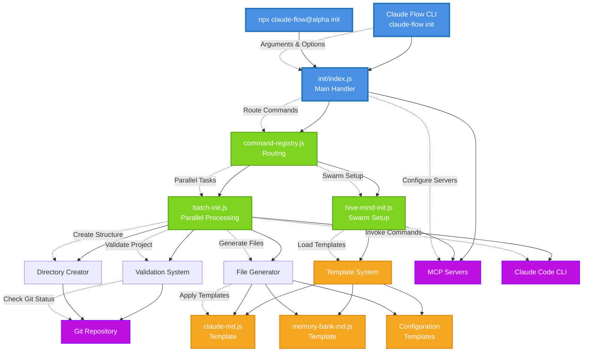

# Component Interaction Diagram

## Component Responsibilities

### Core Components
- **init/index.js**: Main initialization handler and orchestrator
- **batch-init.js**: Handles parallel processing of initialization tasks
- **hive-mind-init.js**: Sets up swarm coordination and agent spawning
- **command-registry.js**: Routes commands to appropriate handlers

### Template System
- **claude-md.js**: Generates Claude Code configuration templates
- **memory-bank-md.js**: Creates memory management templates
- **Configuration Templates**: Various config file templates

### Integration Points
- **Claude Code CLI**: Primary execution environment
- **MCP Servers**: claude-flow, ruv-swarm, flow-nexus coordination
- **Git Repository**: Version control integration