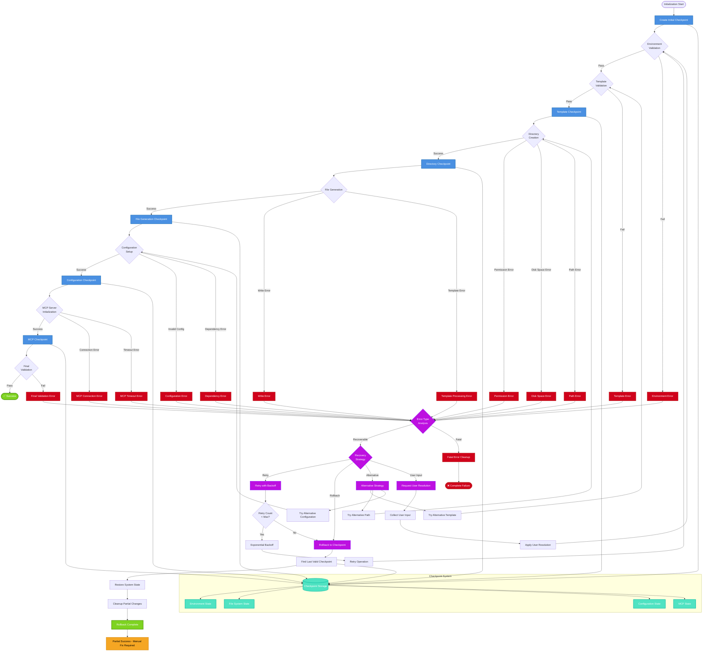

# Error Recovery Flow



## Error Recovery Strategies

### Environment Validation Errors
```javascript
// Node.js Version Mismatch
{
  "error": "UNSUPPORTED_NODE_VERSION",
  "recovery": "prompt_node_upgrade",
  "fallback": "legacy_mode"
}

// Git Repository Issues
{
  "error": "NOT_GIT_REPO",
  "recovery": "git_init",
  "fallback": "standalone_mode"
}

// Permission Issues
{
  "error": "INSUFFICIENT_PERMISSIONS",
  "recovery": "sudo_prompt",
  "fallback": "user_directory"
}
```

### Template Processing Errors
```javascript
// Missing Template Variables
{
  "error": "MISSING_TEMPLATE_VAR",
  "recovery": "prompt_user_input",
  "fallback": "default_values"
}

// Template Syntax Errors
{
  "error": "TEMPLATE_SYNTAX_ERROR",
  "recovery": "alternative_template",
  "fallback": "minimal_template"
}
```

### File System Errors
```javascript
// Disk Space Insufficient
{
  "error": "ENOSPC",
  "recovery": "cleanup_temp_files",
  "fallback": "minimal_installation"
}

// Path Too Long (Windows)
{
  "error": "ENAMETOOLONG",
  "recovery": "shorten_paths",
  "fallback": "root_installation"
}
```

### MCP Server Errors
```javascript
// Connection Timeout
{
  "error": "MCP_TIMEOUT",
  "recovery": "increase_timeout",
  "fallback": "local_mode"
}

// Server Unavailable
{
  "error": "MCP_UNAVAILABLE",
  "recovery": "alternative_server",
  "fallback": "offline_mode"
}
```

## Checkpoint System Details

### Checkpoint Data Structure
```json
{
  "timestamp": "2024-01-15T10:30:00Z",
  "phase": "template_generation",
  "state": {
    "environment": {
      "nodeVersion": "18.17.0",
      "gitRepo": true,
      "workingDirectory": "/project"
    },
    "filesCreated": [
      ".claude/config.json",
      "src/index.js"
    ],
    "configurationsApplied": [
      "package.json",
      ".eslintrc"
    ]
  },
  "rollbackInstructions": [
    "rm -rf .claude/",
    "git checkout HEAD -- package.json"
  ]
}
```

### Recovery Policies
- **Maximum Retries**: 3 attempts with exponential backoff
- **Checkpoint Retention**: Keep last 5 checkpoints
- **Rollback Scope**: Phase-specific or complete rollback
- **User Intervention**: Automatic for non-destructive operations
- **Cleanup Strategy**: Remove partial installations on failure