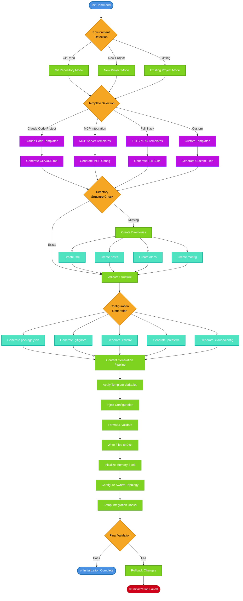

# File Generation Flow

## Template Variables & Injection Points

### Dynamic Variables
- `{{PROJECT_NAME}}` - Project directory name
- `{{AUTHOR}}` - Git user name or system user
- `{{DESCRIPTION}}` - Project description from user input
- `{{TIMESTAMP}}` - Current initialization timestamp
- `{{GIT_REMOTE}}` - Remote repository URL if available
- `{{NODE_VERSION}}` - Detected Node.js version
- `{{SPARC_MODE}}` - Selected SPARC methodology mode

### Configuration Injection
- **Package.json**: Dependencies, scripts, metadata
- **Claude Config**: Agent preferences, hooks, memory settings
- **Git Config**: Ignore patterns, hooks, workflow templates
- **Linting Config**: ESLint rules, Prettier formatting
- **Test Config**: Jest/Mocha setup, coverage thresholds