# Integration Points Diagram

```mermaid
graph TB
    %% Core Claude Flow System
    CLAUDE_FLOW[Claude Flow Core<br/>Init System]

    %% Claude Code CLI Integration
    subgraph CLAUDE_CLI ["Claude Code CLI Ecosystem"]
        CC_MAIN[Claude Code CLI]
        CC_TOOLS[Code Tools]
        CC_HOOKS[Hook System]
        CC_CONFIG[Configuration]
    end

    %% MCP Server Ecosystem
    subgraph MCP_ECOSYSTEM ["MCP Server Ecosystem"]
        MCP_CF[claude-flow MCP]
        MCP_SWARM[ruv-swarm MCP]
        MCP_NEXUS[flow-nexus MCP]
        MCP_BRIDGE[MCP Bridge]
    end

    %% NPM/NPX Ecosystem
    subgraph NPM_SYSTEM ["NPM/NPX Ecosystem"]
        NPM_REG[NPM Registry]
        NPX_EXEC[NPX Executor]
        PKG_LOCK[package-lock.json]
        NODE_MODULES[node_modules]
    end

    %% Git Integration
    subgraph GIT_SYSTEM ["Git Integration"]
        GIT_REPO[Git Repository]
        GIT_HOOKS[Git Hooks]
        GIT_CONFIG[Git Configuration]
        GIT_REMOTE[Remote Repository]
    end

    %% File System
    subgraph FS_LAYER ["File System Layer"]
        PROJECT_ROOT[Project Root]
        CLAUDE_DIR[.claude/]
        CONFIG_FILES[Config Files]
        SOURCE_FILES[Source Files]
    end

    %% External Services
    subgraph EXTERNAL ["External Services"]
        GITHUB[GitHub API]
        ANTHROPIC[Anthropic API]
        REGISTRY[Package Registry]
    end

    %% Main Connections
    CLAUDE_FLOW --> CLAUDE_CLI
    CLAUDE_FLOW --> MCP_ECOSYSTEM
    CLAUDE_FLOW --> NPM_SYSTEM
    CLAUDE_FLOW --> GIT_SYSTEM
    CLAUDE_FLOW --> FS_LAYER

    %% Claude Code CLI Connections
    CC_MAIN --> CC_TOOLS
    CC_MAIN --> CC_HOOKS
    CC_MAIN --> CC_CONFIG
    CC_HOOKS --> MCP_CF

    %% MCP Ecosystem Connections
    MCP_CF --> MCP_BRIDGE
    MCP_SWARM --> MCP_BRIDGE
    MCP_NEXUS --> MCP_BRIDGE
    MCP_BRIDGE --> CC_MAIN

    %% NPM Ecosystem Connections
    NPX_EXEC --> NPM_REG
    NPX_EXEC --> CLAUDE_FLOW
    PKG_LOCK --> NODE_MODULES
    NODE_MODULES --> MCP_CF

    %% Git Integration Connections
    GIT_REPO --> GIT_HOOKS
    GIT_REPO --> GIT_CONFIG
    GIT_HOOKS --> CC_HOOKS
    GIT_REMOTE --> GITHUB

    %% File System Connections
    PROJECT_ROOT --> CLAUDE_DIR
    PROJECT_ROOT --> CONFIG_FILES
    PROJECT_ROOT --> SOURCE_FILES
    CLAUDE_DIR --> CC_CONFIG

    %% External Service Connections
    MCP_CF --> ANTHROPIC
    CC_MAIN --> GITHUB
    NPM_REG --> REGISTRY

    %% Communication Protocols
    CLAUDE_FLOW -.->|"JSON-RPC"| MCP_ECOSYSTEM
    CLAUDE_FLOW -.->|"CLI Arguments"| CLAUDE_CLI
    CLAUDE_FLOW -.->|"Shell Commands"| NPM_SYSTEM
    CLAUDE_FLOW -.->|"File Operations"| FS_LAYER
    CLAUDE_FLOW -.->|"Git Commands"| GIT_SYSTEM

    %% Bidirectional Data Flow
    CC_HOOKS <-.->|"Pre/Post Hooks"| MCP_CF
    GIT_HOOKS <-.->|"Commit Hooks"| CC_HOOKS
    CONFIG_FILES <-.->|"Configuration Sync"| CC_CONFIG
    MCP_BRIDGE <-.->|"Agent Coordination"| CC_MAIN

    %% Styling
    classDef core fill:#4A90E2,stroke:#2171B5,stroke-width:3px,color:#fff
    classDef integration fill:#7ED321,stroke:#5BA016,stroke-width:2px,color:#fff
    classDef ecosystem fill:#F5A623,stroke:#D68910,stroke-width:2px,color:#000
    classDef external fill:#BD10E0,stroke:#9013FE,stroke-width:2px,color:#fff
    classDef filesystem fill:#50E3C2,stroke:#00B6A0,stroke-width:2px,color:#fff

    class CLAUDE_FLOW core
    class CC_MAIN,CC_TOOLS,CC_HOOKS,CC_CONFIG,MCP_CF,MCP_SWARM,MCP_NEXUS,MCP_BRIDGE integration
    class NPM_REG,NPX_EXEC,PKG_LOCK,NODE_MODULES,GIT_REPO,GIT_HOOKS,GIT_CONFIG,GIT_REMOTE ecosystem
    class GITHUB,ANTHROPIC,REGISTRY external
    class PROJECT_ROOT,CLAUDE_DIR,CONFIG_FILES,SOURCE_FILES filesystem
```



## Integration Protocol Details

### Claude Code CLI Integration
```javascript
// Hook Registration
{
  "pre-task": "claude-flow hooks pre-task",
  "post-edit": "claude-flow hooks post-edit",
  "session-restore": "claude-flow hooks session-restore"
}

// Configuration Sync
{
  "agents": ["coder", "tester", "reviewer"],
  "memory": ".claude-flow/memory",
  "topology": "mesh"
}
```

### MCP Server Communication
```json
{
  "method": "swarm/init",
  "params": {
    "topology": "hierarchical",
    "maxAgents": 6,
    "capabilities": ["code", "test", "review"]
  }
}
```

### NPM Integration Points
```bash
# Installation Commands
npx claude-flow@alpha init
npm install claude-flow
npx claude-flow sparc tdd "feature"

# Package Detection
node_modules/.bin/claude-flow
../node_modules/.bin/claude-flow
```

### Git Integration Hooks
```bash
# Pre-commit Hook
.git/hooks/pre-commit -> claude-flow hooks pre-commit

# Post-receive Hook
.git/hooks/post-receive -> claude-flow hooks post-receive

# Pre-push Hook
.git/hooks/pre-push -> claude-flow hooks pre-push
```

## Data Flow Patterns

### Initialization Flow
1. **NPX Execution** → Download latest claude-flow@alpha
2. **Environment Detection** → Check git repo, package.json
3. **Template Selection** → Based on project type
4. **MCP Server Spawning** → Initialize coordination layer
5. **Hook Registration** → Connect to Claude Code CLI
6. **Configuration Generation** → Create project files

### Runtime Communication
1. **Command Routing** → CLI → MCP Bridge → Agents
2. **Memory Sync** → Agents → Memory Bank → File System
3. **Hook Execution** → Git Events → Claude Hooks → MCP Notifications
4. **Status Updates** → MCP Servers → CLI → User Interface