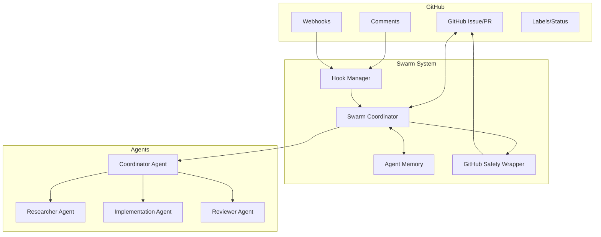

# Complete Implementation Guide: Two-Way GitHub-Swarm Synchronization

## Executive Summary

Based on deep research of ruvnet's claude-flow implementation, this guide explains how to implement comprehensive two-way synchronization between AI swarms and GitHub issues/PRs. The system enables swarms to automatically log their goals, progress, and results to GitHub while accepting commands through comments.

## Core Architecture Overview



## Implementation Components

### 1. GitHub CLI Safety Wrapper
**File**: `src/utils/github-cli-safety-wrapper.js`

The foundation for secure GitHub operations with comprehensive input validation:

```javascript
class GitHubCliSafetyWrapper {
  // Core security features
  validateInput(input) {
    // Check for injection patterns
    const DANGEROUS_PATTERNS = [
      /\$\([^)]*\)/g,    // Command substitution
      /`[^`]*`/g,        // Backtick execution
      /&&|\|\||;|&/g,    // Command chaining
    ];
    // Validate and sanitize
  }
  
  // High-level GitHub operations
  async createIssue(owner, repo, title, body) {
    // Secure issue creation with validation
  }
  
  async addComment(owner, repo, issueNumber, comment) {
    // Safe comment addition with formatting
  }
}
```

### 2. Hook System Integration
**File**: `src/cli/simple-commands/hooks.js`

Hooks provide lifecycle management for GitHub synchronization:

```javascript
// Pre-task hook - Initialize GitHub context
async function preTaskHook(taskDescription) {
  // Load GitHub issue context
  const issueContext = await memoryStore.get('github/issue/context');
  
  // Initialize swarm with GitHub binding
  await execRuvSwarmHook('pre-task', {
    description: taskDescription,
    githubIssue: issueContext?.issueNumber
  });
  
  // Return agent assignments based on issue type
  return getAgentAssignments(issueContext);
}

// Post-task hook - Update GitHub with results
async function postTaskHook(taskId, results) {
  // Store results in memory
  await memoryStore.set(`task/${taskId}/results`, results);
  
  // Update GitHub issue with progress
  await githubWrapper.addComment(
    owner, repo, issueNumber,
    formatProgressUpdate(results)
  );
  
  // Train neural patterns from success
  await execRuvSwarmHook('neural-train', {
    pattern: 'github-coordination',
    data: results
  });
}
```

### 3. Swarm-GitHub Coordinator
**File**: `src/cli/simple-commands/github/gh-coordinator.js`

Central coordination hub for GitHub-swarm integration:

```javascript
class GitHubCoordinator {
  async bindSwarmToIssue(issueNumber, swarmConfig) {
    // Initialize swarm with GitHub context
    const swarmId = await this.initializeSwarm(swarmConfig);
    
    // Store binding in memory
    await memoryStore.set(`github/issue/${issueNumber}/swarm`, {
      swarmId,
      issueNumber,
      startTime: Date.now(),
      status: 'active'
    });
    
    // Set up bidirectional sync
    await this.setupWebhooks(issueNumber, swarmId);
    
    // Post initial status to GitHub
    await this.postInitialStatus(issueNumber, swarmId);
    
    return swarmId;
  }
  
  async handleIssueComment(webhook) {
    // Parse comment for commands
    const command = this.parseCommand(webhook.comment.body);
    
    if (command) {
      // Route command to appropriate swarm
      const swarmId = await this.getSwarmForIssue(webhook.issue.number);
      await this.routeCommandToSwarm(swarmId, command);
    }
  }
}
```

### 4. Memory Persistence Layer
**File**: `src/memory/swarm-memory.ts`

Persistent storage for swarm-GitHub state:

```typescript
interface GitHubSwarmBinding {
  swarmId: string;
  issueNumber: number;
  repository: string;
  lastSync: number;
  status: 'active' | 'paused' | 'completed';
  progress: {
    tasks: TaskProgress[];
    currentPhase: string;
    completionPercentage: number;
  };
}

class SwarmMemoryManager {
  async storeGitHubBinding(binding: GitHubSwarmBinding) {
    const key = `github/issue/${binding.issueNumber}/binding`;
    await this.store.set(key, binding);
    
    // Set up auto-sync interval
    this.scheduleSync(binding.swarmId, binding.issueNumber);
  }
  
  async syncToGitHub(swarmId: string, issueNumber: number) {
    const progress = await this.getSwarmProgress(swarmId);
    const formatted = this.formatProgressForGitHub(progress);
    
    await githubWrapper.addComment(
      this.owner, this.repo, issueNumber, formatted
    );
  }
}
```

### 5. Webhook Handler for Bidirectional Communication
**File**: `src/verification/api/websocket/truth-monitor.js`

Real-time event processing for GitHub webhooks:

```javascript
class GitHubWebhookHandler {
  async handleWebhook(event) {
    switch(event.type) {
      case 'issue_comment.created':
        await this.handleNewComment(event);
        break;
      case 'issues.labeled':
        await this.handleLabelChange(event);
        break;
      case 'pull_request.review_requested':
        await this.handleReviewRequest(event);
        break;
    }
  }
  
  async handleNewComment(event) {
    const comment = event.comment.body;
    
    // Check for swarm commands
    if (comment.startsWith('@swarm')) {
      const command = this.parseSwarmCommand(comment);
      await this.executeSwarmCommand(command, event.issue);
    }
  }
  
  parseSwarmCommand(comment) {
    // Command patterns:
    // @swarm status - Get current progress
    // @swarm pause - Pause execution
    // @swarm priority high - Change priority
    // @swarm assign @agent-name - Assign specific agent
    return parsedCommand;
  }
}
```

## Complete Implementation Workflow

### Step 1: Initialize Swarm with GitHub Binding

```javascript
// When creating a swarm for an issue
async function createIssueSwarm(issueNumber) {
  // 1. Fetch issue details
  const issue = await githubAPI.getIssue(owner, repo, issueNumber);
  
  // 2. Analyze issue complexity
  const complexity = analyzeIssueComplexity(issue);
  
  // 3. Initialize appropriate swarm topology
  const swarmConfig = {
    topology: complexity.high ? 'hierarchical' : 'mesh',
    maxAgents: complexity.estimatedAgents,
    strategy: 'adaptive'
  };
  
  const swarmId = await mcp__claude_flow__swarm_init(swarmConfig);
  
  // 4. Spawn specialized agents based on issue labels
  const agents = await spawnAgentsForIssue(issue.labels);
  
  // 5. Store binding in memory
  await storeGitHubBinding(swarmId, issueNumber, issue);
  
  // 6. Post initialization comment
  await postInitComment(issueNumber, swarmId, agents);
  
  return swarmId;
}
```

### Step 2: Progress Tracking and Updates

```javascript
// Automated progress updates
async function updateGitHubProgress(swarmId, issueNumber) {
  // 1. Gather progress from all agents
  const agentProgress = await gatherAgentProgress(swarmId);
  
  // 2. Calculate overall completion
  const overall = calculateOverallProgress(agentProgress);
  
  // 3. Format progress update
  const update = `
## 🚀 Swarm Progress Update

### Overall Progress: ${overall.percentage}%
${generateProgressBar(overall.percentage)}

### Completed Tasks
${agentProgress.completed.map(t => `- ✅ ${t.description}`).join('\n')}

### In Progress
${agentProgress.inProgress.map(t => `- 🔄 ${t.description} (${t.agent})`).join('\n')}

### Upcoming
${agentProgress.upcoming.map(t => `- ⏳ ${t.description}`).join('\n')}

### Performance Metrics
- Tokens Used: ${overall.tokensUsed}
- Execution Time: ${overall.executionTime}
- Efficiency Score: ${overall.efficiencyScore}

_Last updated: ${new Date().toISOString()}_
🤖 Managed by claude-flow swarm ${swarmId}
  `;
  
  // 4. Post update to GitHub
  await githubWrapper.addComment(owner, repo, issueNumber, update);
  
  // 5. Update issue labels based on progress
  await updateIssueLabels(issueNumber, overall.status);
}
```

### Step 3: Handle GitHub Comments as Commands

```javascript
// Process commands from GitHub comments
async function processGitHubCommand(comment, issueNumber) {
  const swarmId = await getSwarmForIssue(issueNumber);
  
  // Parse command patterns
  const patterns = {
    status: /^@swarm\s+status/i,
    pause: /^@swarm\s+pause/i,
    resume: /^@swarm\s+resume/i,
    priority: /^@swarm\s+priority\s+(\w+)/i,
    assign: /^@swarm\s+assign\s+@([\w-]+)/i,
    execute: /^@swarm\s+execute\s+"([^"]+)"/i
  };
  
  for (const [action, pattern] of Object.entries(patterns)) {
    const match = comment.match(pattern);
    if (match) {
      await executeSwarmAction(swarmId, action, match);
      await postCommandResponse(issueNumber, action, match);
      break;
    }
  }
}
```

### Step 4: Complete Integration Example

```javascript
// Full workflow for issue-driven development
async function issueDriverDevelopment(issueNumber) {
  // Phase 1: Analysis
  const issue = await analyzeIssue(issueNumber);
  const swarmId = await createIssueSwarm(issueNumber);
  
  // Phase 2: Task Decomposition
  const tasks = await decomposeIssueTasks(issue);
  await orchestrateTasks(swarmId, tasks);
  
  // Phase 3: Implementation with Progress Tracking
  const progressInterval = setInterval(async () => {
    await updateGitHubProgress(swarmId, issueNumber);
  }, 30000); // Update every 30 seconds
  
  // Phase 4: Monitor for Commands
  const webhookHandler = new GitHubWebhookHandler();
  webhookHandler.on('comment', async (comment) => {
    await processGitHubCommand(comment.body, issueNumber);
  });
  
  // Phase 5: Completion
  await waitForCompletion(swarmId);
  clearInterval(progressInterval);
  
  // Phase 6: Final Report
  await postFinalReport(issueNumber, swarmId);
  await closeIssueIfRequested(issueNumber);
}
```

## Key Implementation Patterns

### 1. Swarm Initialization Pattern
```javascript
// Always bind swarm to GitHub context on creation
const swarmBinding = {
  githubIssue: issueNumber,
  repository: `${owner}/${repo}`,
  syncInterval: 30000,
  webhookEndpoint: '/webhooks/github',
  commandPrefix: '@swarm'
};
```

### 2. Progress Update Pattern
```javascript
// Structured progress updates with emoji indicators
const progressFormat = {
  header: '## 🚀 Progress Update',
  sections: ['completed', 'inProgress', 'blocked', 'upcoming'],
  metrics: ['tokens', 'time', 'efficiency'],
  footer: 'Generated by claude-flow swarm'
};
```

### 3. Command Processing Pattern
```javascript
// Secure command validation and execution
const commandValidation = {
  allowedCommands: ['status', 'pause', 'resume', 'priority'],
  requiresAuth: true,
  rateLimited: true,
  auditLogged: true
};
```

## Security Considerations

1. **Input Validation**: All GitHub inputs sanitized through safety wrapper
2. **Rate Limiting**: Prevent API abuse with configurable limits
3. **Authentication**: Verify webhook signatures and user permissions
4. **Audit Logging**: Track all swarm-GitHub interactions
5. **Error Recovery**: Graceful handling of GitHub API failures

## Performance Optimizations

1. **Batch Operations**: Group GitHub API calls
2. **Caching**: Store frequently accessed issue data
3. **Async Processing**: Non-blocking webhook handling
4. **Memory Management**: Efficient state persistence
5. **Connection Pooling**: Reuse GitHub API connections

## Monitoring and Debugging

```javascript
// Enable detailed logging for troubleshooting
const debugConfig = {
  logLevel: 'debug',
  logGitHubRequests: true,
  logSwarmEvents: true,
  logMemoryOperations: true,
  metricsEndpoint: '/metrics/github-swarm'
};
```

## Conclusion

Ruvnet's implementation provides a sophisticated, production-ready system for two-way GitHub-swarm synchronization through:

1. **Secure GitHub Integration**: Safety wrapper prevents injection attacks
2. **Hook-Based Lifecycle**: Automated sync at key execution points
3. **Persistent Memory**: Cross-session state management
4. **Bidirectional Communication**: Comments as commands, updates as responses
5. **Intelligent Coordination**: Swarm topology adapted to issue complexity

The system transforms GitHub issues/PRs into intelligent, self-managing development workflows with continuous progress tracking and interactive control through comments.