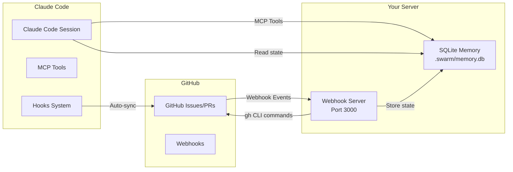

# How Two-Way GitHub-Swarm Sync Actually Runs

## The Architecture: Three Components Working Together



## How It Actually Runs: Three Execution Modes

### Mode 1: Webhook Server (Separate Terminal/Process)

**You need to run a webhook server that listens for GitHub events:**

```bash
# Terminal 1: Start the webhook server
cd your-project
node src/init.js

# Output:
# 🚀 Initializing GitHub-Swarm Sync...
# ✅ GitHub CLI authenticated
# ✅ Memory store initialized
# ✅ Webhook server running on port 3000
# 📝 Configure GitHub webhook:
#    URL: https://your-domain.com/webhooks/github
```

**This server:**
- Runs continuously in the background
- Listens for GitHub webhook events (comments, issues, PRs)
- Processes `@swarm` commands from GitHub comments
- Updates the shared SQLite database

**Production Deployment Options:**
```bash
# Option 1: Use PM2 for process management
npm install -g pm2
pm2 start src/init.js --name github-sync

# Option 2: Use systemd service (Linux)
# Create /etc/systemd/system/github-sync.service

# Option 3: Deploy to cloud (Vercel, Railway, Heroku)
# The webhook server can run as a serverless function
```

### Mode 2: Claude Code Hooks (Automatic)

**Claude Code automatically triggers hooks during operations:**

```javascript
// When you use Claude Code, these hooks fire automatically:

// 1. When you spawn a Task tool:
Task("Implement feature") 
// → Triggers pre-task hook
// → Executes: npx claude-flow hooks pre-task --description "Implement feature"
// → Posts to GitHub: "🚀 Starting task: Implement feature"

// 2. When you edit a file:
Edit("src/index.js", "old", "new")
// → Triggers post-edit hook  
// → Executes: npx claude-flow hooks post-edit --file "src/index.js"
// → Updates GitHub: "✅ Modified src/index.js"

// 3. When task completes:
// → Triggers post-task hook
// → Posts completion status to GitHub
```

**How Hooks Are Configured:**

The hooks are defined in `.claude/settings.json`:
```json
{
  "hooks": {
    "pre-tools": [
      {
        "tool": "Task",
        "command": "npx claude-flow hooks pre-task --description \"${description}\" --github-issue ${GITHUB_ISSUE}"
      }
    ],
    "post-tools": [
      {
        "tool": "Edit",
        "command": "npx claude-flow hooks post-edit --file \"${file}\" --memory-key \"github/edit/${file}\""
      }
    ]
  }
}
```

**Claude Code executes these as subprocesses automatically** when you use the tools.

### Mode 3: MCP Server Integration (Advanced)

**For full integration, claude-flow runs as an MCP server:**

```bash
# Add to Claude Code's MCP servers
claude mcp add claude-flow npx claude-flow@alpha mcp start
```

This gives Claude Code direct access to GitHub tools:
```javascript
// In Claude Code, you can directly use:
mcp__claude_flow__github_repo_analyze { repository: "owner/repo" }
mcp__claude_flow__github_pr_manage { action: "review", pr_number: 123 }
mcp__claude_flow__github_issue_track { action: "create", title: "New issue" }
```

## The Complete Runtime Picture

### Step 1: Initial Setup (One Time)

```bash
# Terminal 1: Install dependencies
npm install

# Terminal 2: Start webhook server
node src/init.js
# Leave this running!

# Terminal 3: Configure GitHub webhook in repo settings
# Go to: https://github.com/you/repo/settings/hooks
# Add webhook:
# - Payload URL: https://your-ngrok-url.ngrok.io/webhooks/github
# - Content type: application/json  
# - Secret: your-webhook-secret
# - Events: Issues, Issue comments, Pull requests
```

### Step 2: During Development (How It Works)

**Scenario A: You're working in Claude Code**
```javascript
// You write code in Claude Code
Edit("src/feature.js", "old code", "new code")
// → Hook fires automatically
// → Posts update to GitHub issue #1
// → "✅ Modified src/feature.js"
```

**Scenario B: Someone comments on GitHub**
```markdown
# Someone comments on issue #1:
@swarm status

# → GitHub sends webhook to your server
# → Server processes command
# → Posts status update back to GitHub
# → "📊 Swarm Status: 3 tasks complete, 2 in progress"
```

**Scenario C: Swarm coordinates across sessions**
```javascript
// Claude Code Session 1:
mcp__claude_flow__memory_usage {
  action: "store",
  key: "github/issue/1/progress",
  value: { tasks_complete: 3, status: "in_progress" }
}

// Claude Code Session 2 (different time):
mcp__claude_flow__memory_usage {
  action: "retrieve",
  key: "github/issue/1/progress"
}
// Gets: { tasks_complete: 3, status: "in_progress" }
// Continues where Session 1 left off
```

## Communication Flow

### GitHub → Claude Code
1. User comments `@swarm analyze code`
2. GitHub webhook → Your webhook server
3. Server writes to `.swarm/memory.db`
4. Claude Code reads from `.swarm/memory.db` via MCP tools
5. Swarm executes the analysis

### Claude Code → GitHub
1. Claude Code performs an action (edit, task, etc.)
2. Hook triggers automatically (subprocess)
3. Hook executes `gh issue comment` command
4. Comment appears on GitHub issue

### Memory Persistence (Key Component)
```
.swarm/memory.db (SQLite database)
├── github/issue/1/swarm     # Swarm binding
├── github/issue/1/progress  # Progress tracking
├── coordination/tasks/*      # Task states
└── swarm/agents/*           # Agent states
```

Both the webhook server AND Claude Code read/write to this shared database.

## Practical Example: Complete Flow

```bash
# 1. Start webhook server (Terminal 1)
node src/init.js

# 2. Create GitHub issue (Terminal 2)
gh issue create --title "Implement user authentication"

# 3. Initialize swarm from GitHub (GitHub.com)
# Comment on issue: "@swarm init"

# 4. Work in Claude Code
# The swarm is now bound to the issue
# All your actions auto-sync to GitHub

# 5. Check status from GitHub (GitHub.com)
# Comment: "@swarm status"
# Bot responds with current progress

# 6. Pause from GitHub if needed
# Comment: "@swarm pause"
```

## Deployment Options

### Local Development
```bash
# Use two terminals
Terminal 1: node src/init.js  # Webhook server
Terminal 2: claude code        # Your normal Claude Code session
```

### Production
```javascript
// Option 1: Serverless (Vercel)
// api/webhook.js
export default async function handler(req, res) {
  await handleGitHubWebhook(req, res);
}

// Option 2: Docker
// Dockerfile
FROM node:18
WORKDIR /app
COPY . .
RUN npm install
CMD ["node", "src/init.js"]

// Option 3: Process Manager
// ecosystem.config.js (PM2)
module.exports = {
  apps: [{
    name: 'github-sync',
    script: 'src/init.js',
    watch: false,
    env: { NODE_ENV: 'production' }
  }]
};
```

## Key Points

1. **Webhook server runs separately** - It's a long-running process that listens for GitHub events
2. **Claude Code hooks fire automatically** - No manual intervention needed
3. **Shared memory via SQLite** - Both systems read/write to `.swarm/memory.db`
4. **MCP tools provide direct access** - Claude Code can directly interact with GitHub
5. **Everything is async** - No blocking between components

## Testing Without Deployment

For local testing without a public URL:

```bash
# Use ngrok to expose local webhook server
ngrok http 3000

# Use the ngrok URL for GitHub webhook
# https://abc123.ngrok.io/webhooks/github
```

This lets you test the full flow without deploying to production.